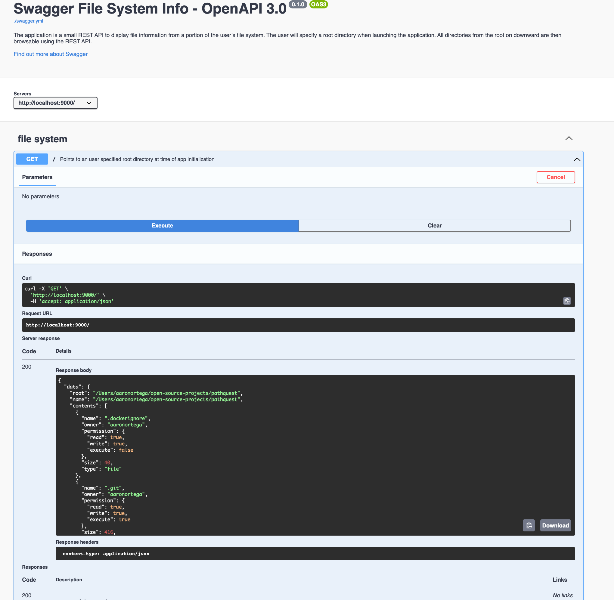

# pathquest

Pathquest is a simple file system API using Python's [http.server](https://docs.python.org/3/library/http.server.html#module-http.server)
library.

## Compatibility
Python 3.9 or greater is required to run the application. The code uses new type hinting features not found in earlier versions of Python.

## Installing
1. Install the source using git
    ```sh
    git clone https://github.com/aaron-ortega/pathquest.git
    ```

2. Install Python 3.9 using [Pyenv](https://github.com/pyenv/pyenv)
    ```sh
    brew install pyenv
    pyenv install 3.9
    ```
3. [Optional] Install Postman to interact with the app
    ```sh
    brew install --cask postman
    ```

## Running
The server can be initiated using a shell script or Docker. Both methods require a specified root path, `$PATH`, indicating the starting point.

### Script
1. Navigate into the cloned repo and execute the script

    ```sh
    ./entrypoint.sh $PATH
    ```

    **Note**: Verify the script has `execute` permission otherwise run the following `chmod u+x entrypoint.sh`.

### Docker
1. Navigate into the cloned repo and build the image

    ```sh
    cd pathquest
    docker build -f Dockerfile -t pathquest .
    ```


2. Run the application

    ```sh
    docker run --rm -it -p 9000:9000 pathquest $PATH
    ```

## Setup local Swagger
Since `http.server` doesn't come with Swagger we will build a local version and point to our app.

1. Follow the steps detailed [here](https://swagger.io/docs/open-source-tools/swagger-ui/development/setting-up/).
2. Copy `swagger.yml` into swagger-ui
    ```sh
    cp swagger.yml ./swagger-ui/dev-helpers/swagger.yml
    ```
3. Navigate to `./swagger-ui/dev-helpers/` and replace

    ```
    url: "https://petstore.swagger.io/v2/swagger.json",
    ```
    with 
    ```
    url: "./swagger.yml",
    ```

Example:


## TODOs:
- Add implementaion of remaining CRUD operations
- Add more docs to `swagger.yml`
